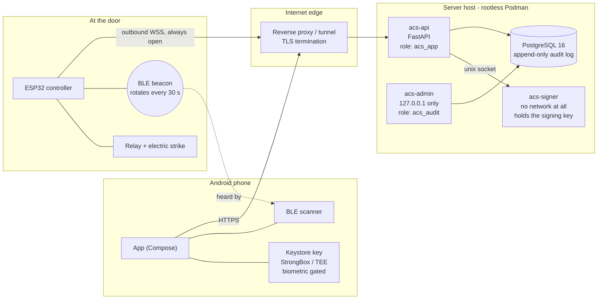
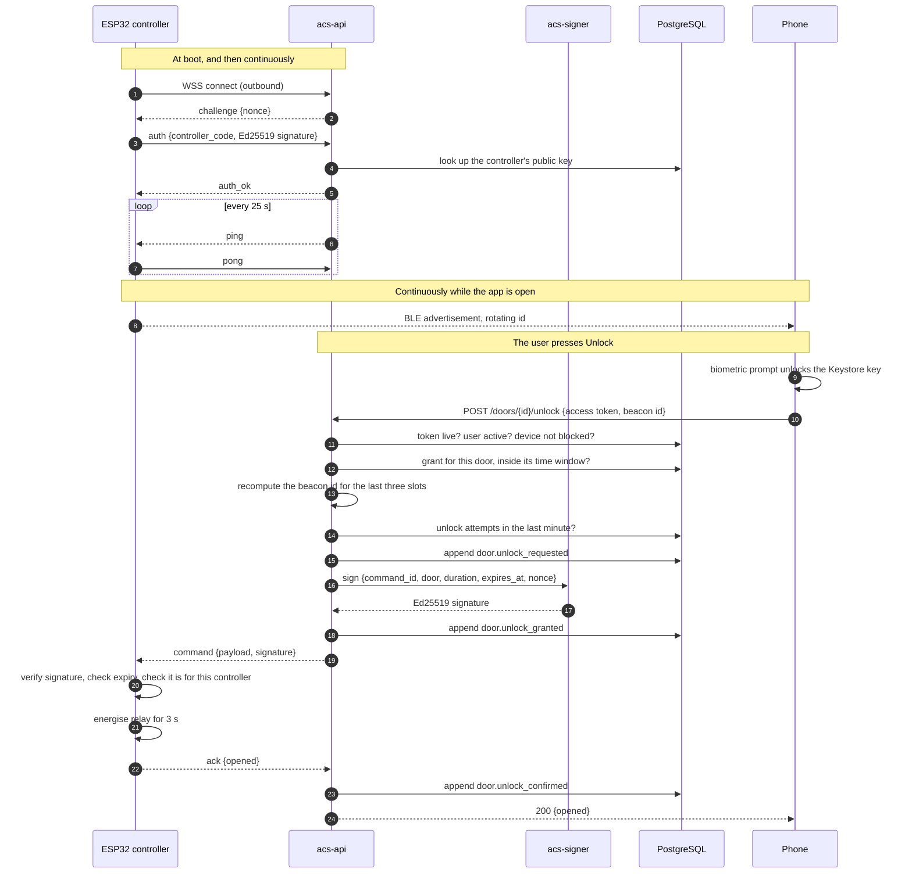

# Architecture

## What the system is

A phone opens a door. Nothing else does.

There are no cards, no fobs, no keypad on the wall and no local unlock path on
the controller. The phone proves who it is to a server, the server decides
whether that person may open that door at that moment, and the server tells
the controller to release the latch. Every step, including every refusal,
becomes a row in a log that cannot be rewritten without leaving evidence.

## Components



Note the direction of every arrow that crosses a trust boundary. The phone
dials the edge. The controller dials the edge. Nothing dials the controller,
and nothing dials the signer.

## The unlock flow



If any check fails, the audit row is written with the real reason and the
phone gets one of five coarse answers. If the controller does not acknowledge,
the response is a failure — the system never reports a door as opened on the
strength of having sent a command.

## Decisions, and why

### Opaque tokens, not JWTs

This is the decision most likely to be questioned, so it goes first.

A JWT is valid because it verifies. That is the entire appeal: no database
round trip. The cost is that there is no moment at which the server can stop
honouring one. To revoke a JWT before it expires you keep a list of revoked
tokens and check it on every request — at which point the round trip is back,
and what remains is a bearer credential whose contents the holder can read and
whose lifetime you cannot shorten.

For a door, revocation speed is the whole product. A phone is reported lost at
14:02 and must stop opening doors at 14:02, not at 14:17 when a fifteen minute
token happens to expire. Short JWT lifetimes only narrow the window; they do
not close it, and they push the refresh traffic up until the round trip you
were avoiding happens constantly anyway.

So: 32 random bytes, URL safe, no structure. The database stores
`SHA-256(pepper || token)` and nothing else. Revocation is
`UPDATE tokens SET revoked_at = now()`, and the next request fails. A stolen
database dump contains hashes of 256-bit random values, peppered with a value
that lives in the process environment — there is no dictionary to run.

SHA-256 rather than Argon2 for tokens, deliberately: the input already has 256
bits of entropy, so there is nothing to slow an attacker down about, and this
runs on every authenticated request. Argon2id is used for passwords, where the
input is a human-chosen string.

### Refresh rotation with reuse detection

Each login opens a token *family*. Refreshing mints a new pair in the same
family and marks the old refresh token used. If a used refresh token appears
again, the whole family is revoked.

There is no way for the server to tell a legitimate retry after a lost
response apart from a thief using a copied token. Given that ambiguity, the
safe interpretation is theft: the honest user is signed out and signs in
again, which is an annoyance; the thief is signed out too, which is the point.
Accepting the replay silently would leave an attacker with a session that
renews itself forever.

This has a consequence the client has to respect: the app serialises refreshes
process-wide, because two concurrent refreshes would present the same rotated
token twice and trip the server's own theft detection.

### Proximity, and what it is not

A valid token says the holder is authorised. It says nothing about where they
are standing. Malware with a live token, or a token pulled from a compromised
backup, can send a perfectly formed unlock request from another continent.

Each controller advertises

```
beacon_id(slot) = HMAC-SHA256(beacon_key, "acs-beacon:v1" || slot)[:16]
slot            = floor(unix_seconds / 30)
```

The phone reports what it heard. The server recomputes the identifiers for the
slots covering the freshness window and accepts only a match. The phone's own
clock is never consulted — freshness comes from *which slot the value belongs
to*, so a phone with a wrong or attacker-controlled clock cannot widen the
window.

What this does not stop is a relay: two radios, one at the door and one next
to the phone, forwarding the advertisement live. The phone genuinely does hear
a current identifier. The real fix is a round-trip time bound, which needs a
connectable BLE characteristic rather than a plain advertisement; it is on the
roadmap and listed as residual risk T-11. What the beacon does buy today is
the elimination of the remote attack, which is the one that scales.

### The signer is a separate process

The Ed25519 key that signs unlock commands lives in `acs-signer`, which runs
in its own container with no network namespace at all, a read-only root
filesystem, and exactly one way in: a Unix socket. It answers two questions —
"what is your public key" and "sign this command" — and it validates the
command before signing it.

The value of the split is specific. An attacker who owns the API container can
make the signer sign unlock commands *while they are there*, and gets nothing
that outlives that access. An attacker who owns a process holding the key can
mint commands forever, including for controllers that are offline today and
will accept them tomorrow. Compromise of the API is bad; compromise of the key
is unrecoverable without reflashing every door.

The signer also enforces its own ceiling: `duration_ms` at most 10 seconds,
command lifetime at most 30 seconds, `cmd` must be `unlock`. A fully
compromised API cannot obtain a signature for a command that holds a door open
for an hour, because the limit is in the process that holds the key rather
than in the process asking.

### The controller dials out

The ESP32 opens a WSS connection to the backend and keeps it open. It never
listens. There is no port to scan at the door, no inbound firewall rule, no
NAT traversal, and no port forwarding for an installer to get wrong. This is
the single largest reduction in attack surface in the design: the controller
is not addressable.

It also fails in the right direction. If the link drops, the door stays
locked. There is no offline mode, no cached credential list and no local
override. That is a real operational cost, accepted deliberately — a lock that
opens when the network is down is not a lock.

### The audit log is append-only in the database, not in the code

"The application only appends to it" is not a property; it is a habit. Three
independent layers make it a property:

1. **Grants.** `acs_app` holds `INSERT` and `SELECT` on `audit_log`. No
   `UPDATE`, no `DELETE`, no `TRUNCATE`. A remote code execution bug in the
   API leaves the attacker holding a connection that cannot express the
   statement they want.
2. **Triggers.** `deny_mutation` and `deny_truncate` raise an exception
   whoever is asking, including the table's owner. Grants can be changed by a
   superuser in one statement; this makes that not enough.
3. **Hash chain.** Each row stores the SHA-256 of its own canonical
   serialisation concatenated with the previous row's hash, computed by a
   `SECURITY DEFINER` BEFORE INSERT trigger from the row the database is about
   to store. Whatever the application sends for those columns is overwritten.

A superuser can defeat layers 1 and 2 with
`SET session_replication_role = replica`. They cannot defeat layer 3, because
every row after the one they edited commits to a hash they have just
invalidated. `verify_audit_chain()` names the first row that does not add up,
and `backend/tests/test_audit_chain.py` performs exactly that attack.

The chain's honest limit: deleting rows from the *end* leaves a shorter but
internally consistent chain. `audit_chain_head()` exists so that `(seq, hash)`
can be published somewhere the database administrator does not control, which
turns tail truncation from invisible into obvious. That is T-19.

### Raw SQL migrations, not Alembic autogenerate

Autogenerate compares SQLAlchemy metadata against the live database. Triggers,
`SECURITY DEFINER`, role grants, partitioning and partial indexes are all
invisible to that comparison — and, critically, it does not error on any of
them. It produces a migration that applies cleanly and quietly leaves the
database without its triggers and without its grants. A security control that
can disappear without a failed build is not a control.

Full reasoning, with the table of what gets dropped, is in
[`backend/db/README.md`](../backend/db/README.md).

### The admin application is a separate app on loopback

It can grant someone access to a door, revoke a device and read the entire
audit trail. The phone app can do none of those things. The two share a
database and nothing else, so publishing them together would mean the
internet-facing process carries code paths that mint permissions.

It binds to `127.0.0.1`, has no public hostname and no DNS record. In the
reference deployment it is reached over a private mesh network — not merely
protected from the internet, but not addressable from it.

It also uses a different database role. `acs_audit` can read and append
`audit_log` and nothing else: an operator browsing the trail is not holding a
connection that can read password hashes.

### No role holds DELETE

Anywhere. Removal is `is_active = false`, `is_blocked = true` or
`revoked_at = now()`. Audit retention is a partition detach, never a delete.
This is tested — `test_app_role_holds_no_delete_anywhere`.

## Trust boundaries, stated plainly

| Boundary | What is trusted across it | What is not |
|---|---|---|
| Phone → API | that the token names a session | anything the phone says about itself, its clock, or where it is |
| API → signer | that the caller wants a signature | that the command is reasonable — the signer checks |
| API → controller | nothing; the signature is the authority | the API could be lying about who asked |
| Controller → API | that a signed ack came from this controller | anything else it reports |
| Database → application | stored rows | that they have not been tampered with — the chain is checked |

## What is deliberately absent

* No local unlock on the controller — no button, no keypad header, no serial
  command that opens the door.
* No offline mode on the phone — nothing cached, nothing queued.
* No JWT, anywhere.
* No `DELETE` grant, anywhere.
* No inbound port at the door.
* No public hostname for the admin application.
* No secret in the repository. Every one comes from the environment, and
  `.env.example` lists them with empty values.
